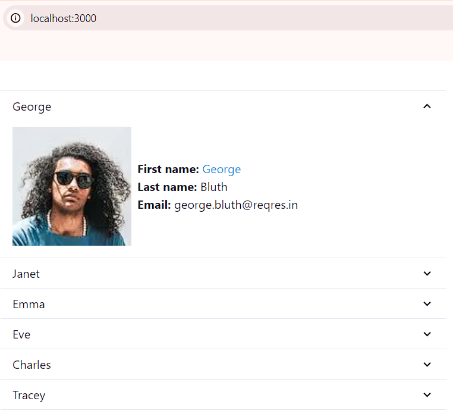
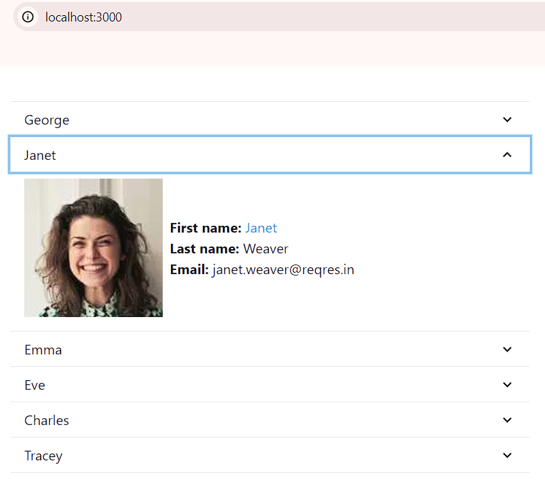
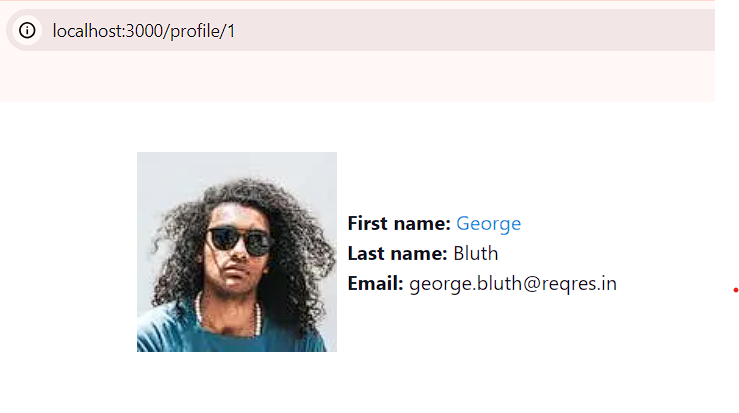

# React.js / Next.js / Chakra UI / TanStack Query interview assignment
This is a [Next.js](https://nextjs.org/) project bootstrapped with [`create-next-app`](https://github.com/vercel/next.js/tree/canary/packages/create-next-app), [`Chakra UI`](https://v2.chakra-ui.com/getting-started/nextjs-app-guide), and [`TanStack Query`](https://tanstack.com/query/latest/docs/framework/react/installation).

- [Getting Started](#getting-started)
- [The task](#the-task)
    * [Requirements](#requirements)
    * [Screenshots of example solution](#screenshots-of-example-solution)

## Getting Started
1. Fork this repo on GitHub and clone it to your local PC.

2. Install Node.js

3. Run
    ```bash
    npm i
    ```

4. Run
    ```bash
    npm run dev
    ```

## The task
The overall task of this assignment is to fetch data from an external API and create 2 pages which displays the data.

If you have any questions regarding the assignment you can contact [lasse@bluebirdday.dk](mailto:lasse@bluebirdday.dk) with any questions.

Good luck! 🙂

### Requirements
1. On the [/](/) route create a list of accordions displaying the information from the public API https://reqres.in/api/users. If needed, you can query the information for a single user on https://reqres.in/api/users/{id}.

    There's no need to validate the response from the API, but please think about how you would do it, as we may discuss it at the interview.

2. Clicking on the user's first name will redirect the user to [/profile/{id}](/profile/{id}) where ID is the user's ID. 
The [/profile/{id}](/profile/{id}) page will show the clicked user's information.

3. Use Next.js for routing, Chakra UI for components and styling and TanStack Query for querying the API.

4. Push your changes to your repository and get ready to present your code at the interview by sharing your screen.

### Screenshots of example solution
You will be assesed on your ability to understand the requirements and your code quality. 
Your solution does not have to look like the example solution as long as it fulfills the requirements in the [The task](#the-task) section.




